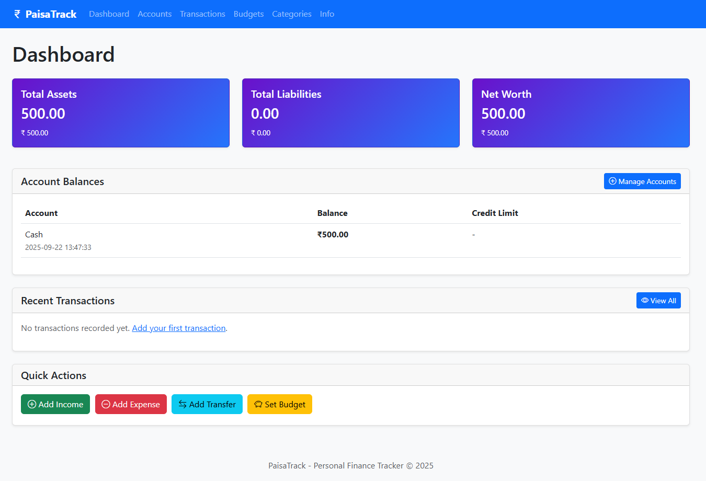
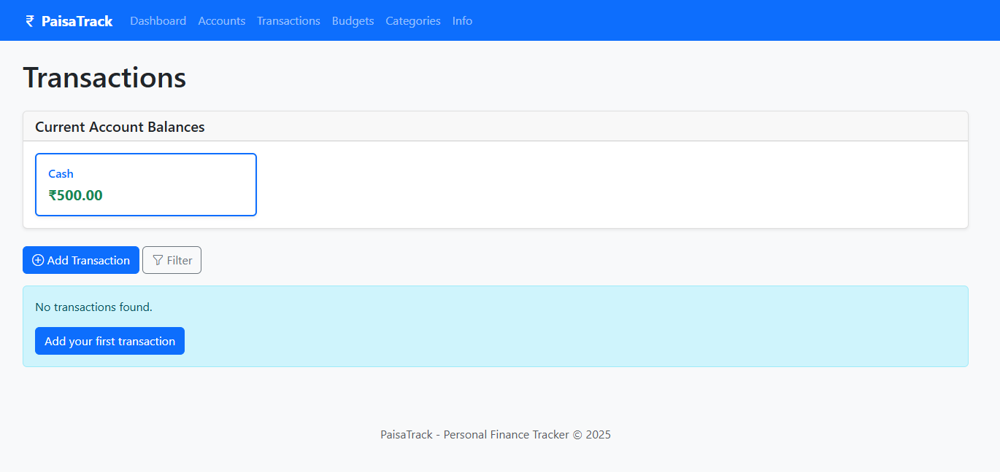
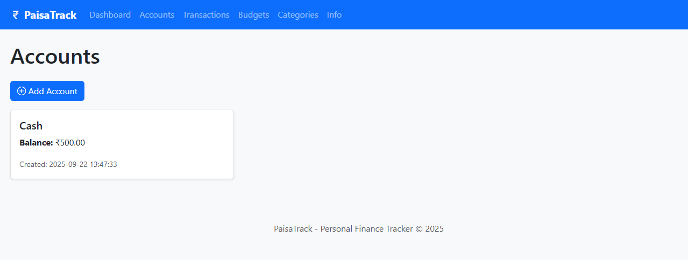
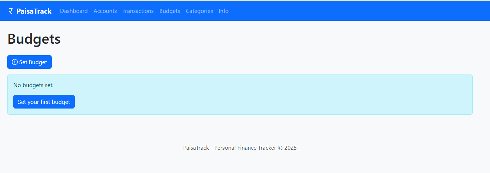
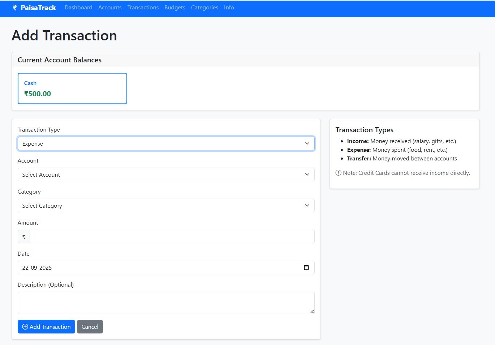

# PaisaTrack - Personal Finance Tracker



PaisaTrack is a comprehensive personal finance management web application built with Python Flask and MongoDB. It helps you track income, expenses, transfers, budgets, and monitor your net worth over time.

## Table of Contents

- [Features](#features)
- [Technologies Used](#technologies-used)
- [Project Structure](#project-structure)
- [Setup and Installation](#setup-and-installation)
- [Database Setup](#database-setup)
- [Running the Application](#running-the-application)
- [Usage](#usage)
- [Screenshots](#screenshots)
- [API Endpoints](#api-endpoints)
- [Contributing](#contributing)
- [License](#license)

## Features

- **Account Management**: Track multiple account types (Cash, Bank, Credit Card, etc.)
- **Transaction Tracking**: Record income, expenses, and transfers between accounts
- **Budget Management**: Set and monitor budgets for different categories
- **Category Management**: Customizable income, expense, and transfer categories
- **Financial Dashboard**: Overview of account balances, net worth, and recent transactions
- **Reporting**: Detailed transaction history with filtering and pagination
- **Responsive Design**: Works on desktop, tablet, and mobile devices
- **Data Persistence**: MongoDB database for reliable data storage

## Technologies Used

- **Backend**: Python 3, Flask
- **Database**: MongoDB
- **Frontend**: HTML5, CSS3, JavaScript, Bootstrap 5
- **Template Engine**: Jinja2
- **Styling**: Bootstrap 5, Custom CSS
- **Icons**: Bootstrap Icons

## Project Structure

```
paisatrack/
│
├── app.py                 # Main application entry point
├── init_mongo.py          # Database initialization script
├── README.md              # Project documentation
├── .gitignore             # Git ignore file
│
├── models/
│   └── finance.py         # Finance model with database operations
│
├── routes/
│   └── main.py            # Flask routes and controllers
│
├── utils/
│   └── database.py        # Database connection utilities
│
├── templates/
│   ├── base.html          # Base template with common layout
│   ├── index.html         # Dashboard page
│   ├── accounts.html      # Accounts management page
│   ├── add_account.html   # Add new account page
│   ├── transactions.html  # Transactions listing page
│   ├── add_transaction.html # Add new transaction page
│   ├── budgets.html       # Budgets management page
│   ├── add_budget.html    # Add new budget page
│   ├── categories.html    # Categories management page
│   ├── manage_categories.html # Manage categories page
│   └── info.html          # Information page
│
├── static/
│   ├── css/
│   │   └── style.css      # Custom CSS styles
│   └── js/
│       └── script.js      # Custom JavaScript
│
└── screenshots/           # Application screenshots
    ├── dashboard.png      # Dashboard screenshot
    ├── transactions.png   # Transactions page screenshot
    ├── accounts.png       # Accounts page screenshot
    ├── budgets.png        # Budgets page screenshot
    └── add_transaction.png # Add transaction page screenshot
```

## Setup and Installation

### Prerequisites

- Python 3.7 or higher
- MongoDB 4.0 or higher
- pip (Python package installer)

### Installation Steps

1. **Clone the repository**:
   ```bash
   git clone <repository-url>
   cd paisatrack
   ```

2. **Create a virtual environment** (recommended):
   ```bash
   python -m venv venv
   # On Windows
   venv\Scripts\activate
   # On macOS/Linux
   source venv/bin/activate
   ```

3. **Install required packages**:
   ```bash
   pip install flask pymongo
   ```

4. **Install MongoDB**:
   - Download and install MongoDB from [mongodb.com](https://www.mongodb.com/try/download/community)
   - Follow the installation instructions for your operating system

## Database Setup

1. **Start MongoDB service**:
   - On Windows: Start the MongoDB service from Services
   - On macOS: `brew services start mongodb-community`
   - On Linux: `sudo systemctl start mongod`

2. **Initialize the database**:
   ```bash
   python init_mongo.py
   ```

   This script will:
   - Create the `paisatrackIN` database
   - Initialize default categories
   - Set up default information data

## Running the Application

1. **Start the Flask application**:
   ```bash
   python app.py
   ```

2. **Access the application**:
   Open your web browser and navigate to `http://localhost:5000`

## Usage

### Adding Accounts

1. Navigate to the "Accounts" page
2. Click "Add Account"
3. Enter account details:
   - Account Type (Cash, Bank Account, Credit Card, etc.)
   - Initial Amount
   - Last 4 digits (optional, for credit/debit cards)

### Recording Transactions

1. Navigate to the "Transactions" page
2. Click "Add Transaction"
3. Select transaction type:
   - **Income**: Money received
   - **Expense**: Money spent
   - **Transfer**: Money moved between accounts
4. Fill in the required details and submit

### Setting Budgets

1. Navigate to the "Budgets" page
2. Click "Add Budget"
3. Select a category and set budget amount
4. Choose time period (weekly, monthly, yearly, or custom)

### Managing Categories

1. Navigate to the "Categories" page
2. Click "Manage Categories"
3. Add or remove categories as needed

## Screenshots

### Dashboard

*Overview of account balances, net worth, and recent transactions*

### Transactions

*Detailed transaction history with filtering and pagination*

### Accounts

*Account management interface*

### Budgets

*Budget tracking and management*

### Add Transaction

*Transaction creation form with dynamic category selection*

## API Endpoints

| Endpoint | Method | Description |
|----------|--------|-------------|
| `/` | GET | Dashboard with account balances and net worth |
| `/accounts` | GET | List all accounts |
| `/accounts/add` | GET/POST | Add new account |
| `/transactions` | GET | List all transactions with filtering |
| `/transactions/add` | GET/POST | Add new transaction |
| `/budgets` | GET | List all budgets |
| `/budgets/add` | GET/POST | Add new budget |
| `/categories` | GET | List all categories |
| `/categories/manage` | GET/POST | Manage categories |
| `/info` | GET | Application information |

## Folder Structure Details

### Models (`models/`)
- `finance.py`: Contains the FinanceModel class with all database operations for accounts, transactions, budgets, categories, and info.

### Routes (`routes/`)
- `main.py`: Contains all Flask routes and controller logic for the application.

### Utilities (`utils/`)
- `database.py`: Database connection utilities and helper functions.

### Templates (`templates/`)
- Base template and all HTML pages with Jinja2 templating.

### Static Files (`static/`)
- CSS stylesheets and JavaScript files for frontend styling and functionality.

### Screenshots (`screenshots/`)
- Visual documentation of the application interface.

## Contributing

1. Fork the repository
2. Create a feature branch (`git checkout -b feature/AmazingFeature`)
3. Commit your changes (`git commit -m 'Add some AmazingFeature'`)
4. Push to the branch (`git push origin feature/AmazingFeature`)
5. Open a Pull Request

## License

This project is licensed under the MIT License - see the [LICENSE](LICENSE) file for details.

---

**PaisaTrack** - Your personal finance management solution